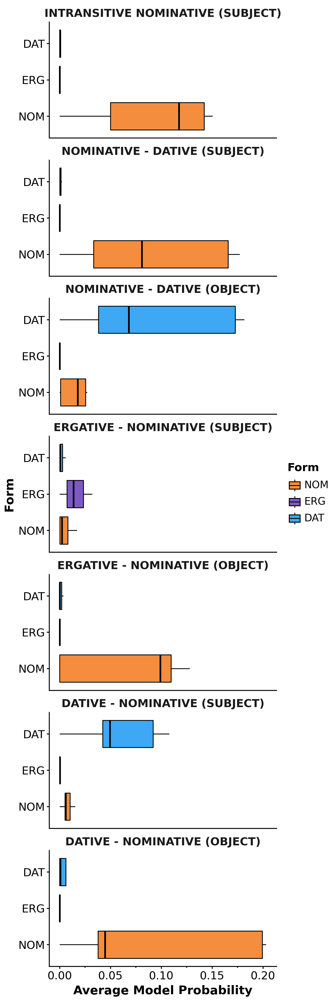

## Targeted Syntactic Evaluation of Georgian Case Alignment

This repository contains the code used to run the evaluations of models on the [Georgian Case Alignment](huggingface.co/datasets/DanielGallagherIRE/georgian-case-alignment) dataset.
The corresponding paper has been accepted to LoResLM 2026 at EACL and will be released soon.
Much of the creation and evaluation of the dataset uses code from the repository [Grew-TSE](https://github.com/DanielGall500/Grew-TSE).
More details of this work to be released soon...

#### Georgian Case Alignment

#### Average Word-Level Probability by Task

